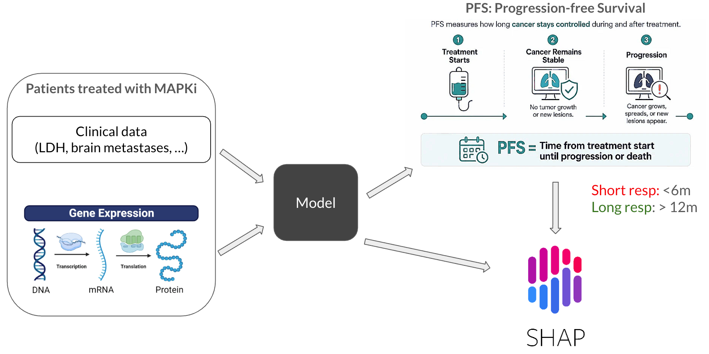
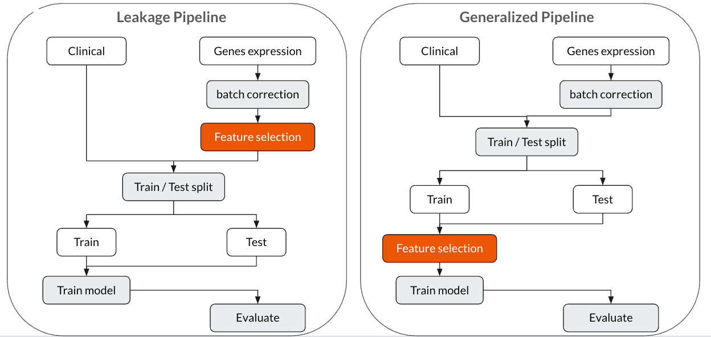

# MelanOrganoPredict : Patient-derived melanoma organoids, a promising predictive platform for therapeutic screening?

Overall pipeline (for detail, check the documentation).



## Documentation

Check out all weekly reports and complete reports of the project here: [Drive](https://drive.google.com/drive/folders/1eKSyY4ZnwTqRcCWgGeeYKSLURGvJOJrx?usp=sharing)

## Requirements

First, install all libaries (maybe create a virtual environment?):

```setup
pip install numpy pandas scikit-learn scipy xgboost matplotlib seaborn shap shapiq optuna joblib polars pacmap umap-learn rpy2 lifelines imodels
```
Second, download these two datasets from MelanoDB: `clinical.csv` & `gene_expressions.csv` and save them into a folder `dataset/original`

## Preprocess data

The preprocess logic is given in `preprocess-data` folder.

First, preprocess the Clinical dataset with `1_clinical.ipynb`.

Second, preprocess the Gene expression dataset with `2_gex.ipynb`.

Third, merge these two datasets with `3_clinical_gex.ipynb`.

Fourth, prepare data for batch-correction with `4_gex_mat.ipynb`.

There is a separate script (`tcga_gdc.ipynb`) for preprocessing the TCGA data. With this data, there is NO batch effect, so it does NOT need to be batch-corrected.

## Batch-correction

Since the samples are from different cohorts, batch-correction is needed. The batch-correction logic is given in `batch-correction\5_batch_correction.R` (maybe run it with RStudio?).

## Training & Evaluation

The training and evaluation logics are given in `pipeline` folder. There are three different script depends on the pipeline and model used.

We considered two pipeline:

- Leakage: the genes are selected on both Train & Test set
- Generalized: the genes are selected only on Train set

We also used two different models: Logistic regression & XGBoost.

The scripts for testing our pipelines and models on the TCGA dataset are also given.

Comparing leakage and generalized pipeline



## Explanation

The scripts for generating explanation of the trained model are given in `explanation` folder. We use two different libraries:

- SHAP: for investigating individual feature importance
- SHAP-IQ: for investigating interation between features
